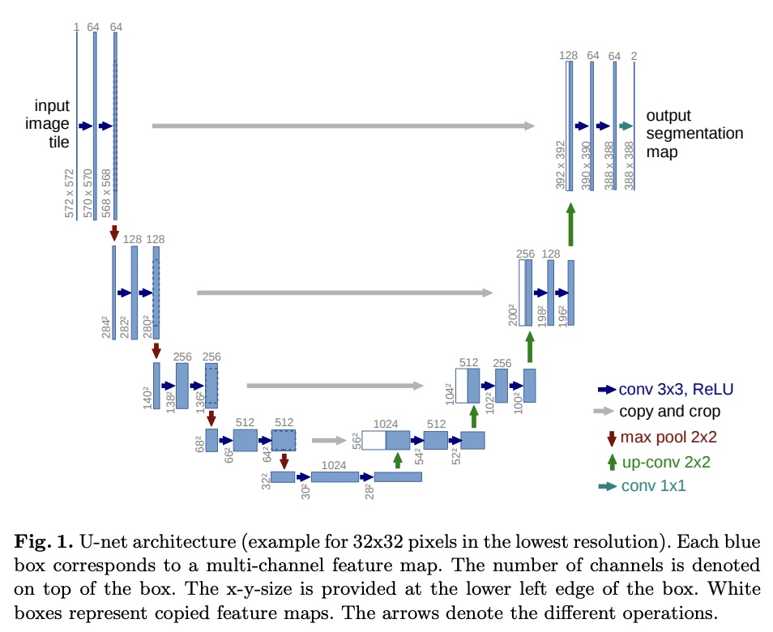
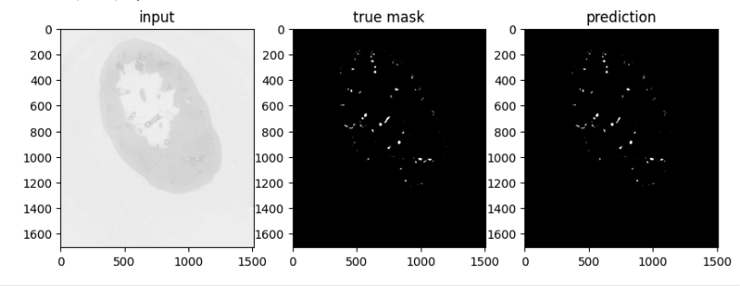

# Kidney Segmentation Model

This repository contains code used for the Kaggle competition
[SenNet + HOA - Hacking the Human Vasculature in 3D](https://www.kaggle.com/competitions/blood-vessel-segmentation).
The goal of this competition was to build a computer vision model
to create segmentation masks marking blood vessels in 2D scans of human kidneys.
The trained models and pipelines from this repository achieve a surface dice score of 
~0.79 on the public test set and ~0.49 on the private test set (~15th percentile of notebook submissions).

## Model Architecture 
As is common for medical imaging tasks, the models I worked with were based on the 
[UNet model architecture](https://arxiv.org/abs/1505.04597). UNet is an encoder/decoder architecture. In its 
simplest form, it is based on convolutional layers (see below; image taken from 
_U-Net: Convolutional Networks for Biomedical Image Segmentation_).
 The left side of U-Net acts as an encoder, creating the most relevant features based on the
training images. The right side act as the decoder. It uses the features from the encoder to determine whether each pixel should be classified as belonging to a blood vessel or not in the segmentation masks.

For more complicated models, I tried the [attenU-Net](https://arxiv.org/abs/1804.03999), which adds attention 
gates to the skip connections. I also used pre-trained backbones, which replace the encoder part of the UNet. 
A useful repository for implementing these is [segmentation_models.pytorch](https://github.com/qubvel/segmentation_models.pytorch).
Two which were particular effective were the __resnext50_32x4d__ (convolution based) and the __mit_b2__ (mix vision transformer).
The pre-trained models and the final models tuned on the kidney segmentation masks provided are [here](https://drive.google.com/drive/folders/1r_tXIvPcyfwgS9-WRN7LuQ5h2xcFq4hR?usp=drive_link).

## Training 
For training, there were segmentations for 3 kidneys provided. However, only 2 had accurate labellings, whereas the third was sparsely segmented at 65%.  I only used the 
complete segmentations for training, though it would have been interesting to test approaches using pseudo-labeling for the sparsely segmented kidney.
The effective amount of training data could be increased by building an image augmentation pipeline consisting of rotations, changes in brightness, etc., which I did with the 
[albumentations library](https://albumentations.ai/).  Another trick for expanding the training set was to take the stack of 2d kidney images (originally sliced along the z axis), stack them 
together, and then slice the resulting 3d block in the x and y directions, with these new images used for training as well.  In addition, to ensure the model was flexible enough to handle input images of 
varying size, I broke each 2d image into a set of 512x512 pixel tiles, which were fed into the model for training.

Choosing a proper loss function also turned out to be critical.  The simplest choice was 
binary cross entropy, as this is essentially a pixel-wise classification problem. However, this turned out to not be a
good proxy for the competition metric, [surface dice](https://github.com/google-deepmind/surface-distance).  Often, an incremental improvement on BCE would lead to a no improvement or a worsening of surface dice, _even when evaluating on just the training set itself_. Some alternatives I tried were [focal loss](https://arxiv.org/abs/1708.02002) and [dice loss](https://arxiv.org/abs/1707.03237), with the latter providing the best proxy for 
surface dice.

For validation, one simple approach was to train on one completely segmented kidney, and then to do validation on the second completely segmented kidney. However, this turned out to 
give a very poor estimate for the test error.  This was evident because it was relatively easy to build a model which performed well on the training kidney and the validation kidney, but then 
performed terribly on the hidden test kidney.  This indicated that there was very high variation from kidney to kidney, making parameter tuning very difficult. As a result, I opted to not tune precisely, 
and instead looked for model configurations which performed consistently on the hidden test kidney across a wide range of parameters.

## Inference
When it came to inference, the models I initially trained suffered from a high false negative rate, meaning they were missing a high number of 
detections. To improve this, I implemented test time augmentation, which is similar in spirit to train time augmentation. The main idea is to provide the model 
with multiple views of the kidney during inference, giving it many chances to make a detection. Specifically, my model performed inference on 
rotated and flipped versions of each image tile. It also sliced the kidney along all three axes, again increasing the number of chances to make a detection.  Whenever the model made a detection 
for some view, the pixel was classified as belonging to a blood vessel.

## Conclusion
Below is an example of segmentation mask produced during validation. The challenge was a great way to 
dive into an area that I previously knew nothing about, and develop working knowledge in a short period of time. Plus,
it's pretty satisfying to see some of the segmentation masks produced during validation:

